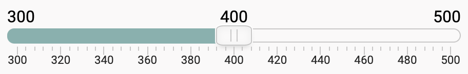

# [](demo/assets/favicon/favicon-32x32.png) FreeSlider



---

- <a href="https://psarewivan.github.io/fsd-task-4/">Демо-страница проекта</a>

## Опиание

- Учебный проект на должность frontend-разработчика команды MetaLamp
- JQuery плагин слайдера

## Зависимости

- JQuery 3.5.1+
- Lodash 4.17.20+

## Разработчикам

- Установка `npm i`
- Запуск сервера `npm start`
- Сборка проекта `npm run build`
- Запуск тестов `npm run test`
- Покрытие тестами `npm run coverage`

## Инициализация слайдера на странице

```html
<body>
  <div id="slider"></div>
</body>
```

```js
$('#slider').freeSlider(Object);
```

Где `Object` - объект с параметрами слайдера.

Доступные параметры:

| Option         | Defaults                                            | Type     | Description                                                                                                                                              |
| -------------- | --------------------------------------------------- | -------- | -------------------------------------------------------------------------------------------------------------------------------------------------------- |
| `min`          | `0`                                                 | number   | Установка минимального значения                                                                                                                          |
| `max`          | `100`                                               | number   | Установка максимального значения                                                                                                                         |
| `step`         | `1`                                                 | number   | Установка шага. Допустимы значения > 0                                                                                                                   |
| `values`       | `[50]` - для одиночного, `[20, 90]` - для интервала | number[] | Установка значений слайдера                                                                                                                              |
| `type`         | `single`                                            | string   | Установка типа слайдера, возможные варианты: `single`, `range`                                                                                           |
| `orientation`  | `horizontal`                                        | string   | Установка ориентации слайдера. Возможные варианты: `horizontal`, `vertical`                                                                              |
| `scale`        | `false`                                             | boolean  | Показ/скрытие шкалы значений                                                                                                                             |
| `scaleMark`    | `4`                                                 | number   | Установка на сколько основных частей будет делится шкала. Рядом с ними отображается числовое значение, соответствующее слайдеру                          |
| `subScaleMark` | `5`                                                 | number   | Установка на сколько дополнительных частей будет делится каждая основная часть шкалы. Рядом с ними НЕ отображается числовое значение                     |
| `tooltips`     | `true`                                              | boolean  | Показ/скрытие минимального и максимального значения слайдера                                                                                             |
| `hints`        | `true`                                              | boolean  | Показ/скрытие числовых подсказок над ползунками                                                                                                          |
| `onChange`     | `null`                                              | Function | Функция-коллбек, которая будет вызвана при изменении значения слайдера. В функцию будет передан массив текущих значений                                  |
| `onFinish`     | `null`                                              | Function | Функция-коллбек, которая будет вызвана при окончании изменения значений слайдера (событие PointerEvent). В функцию будет передан массив текущих значений |
| `onUpdate`     | `null`                                              | Function | Функция-коллбек, которая будет вызвана при обновлении слайдера. В функцию будет передан массив текущих значений                                          |

## Публичное API для работы со слайдером

Для изменения состояния слайдера "снаружи" следует пользоваться публичными методами. Пример:

```html
<body>
  <div id="slider"></div>
</body>
```

```js
const slider = $('#slider');
slider.freeSlider(); // Инициализация
slider.freeSLider('update', {
  values: [10],
  step: 2,
  min: 5,
}); // Установка значения слайдера
```

Перечень публичных методов:

| Name       | Input data | Output data | Description                                                                                                                                                                                      |
| ---------- | ---------- | ----------- | ------------------------------------------------------------------------------------------------------------------------------------------------------------------------------------------------ |
| `update`   | Object     | -           | Обновляет состояние слайдера. На вход принимает объект с такими допустимыми свойствами: `values`, `step`, `min`, `max`, `hints`, `tooltips`, `scale`, `orientation`, `scaleMark`, `subScaleMark` |
| `getState` | -          | Object      | Возвращает объект с текущим состоянием слайдера                                                                                                                                                  |
| `onChange` | Function   | -           | Вызывает переданную функцию-коллбек при каждом изменении значений слайдера. В коллбек передается массив значений слайдера.                                                                       |
| `onLoad`   | Function   | -           | Вызывает переданную функцию-коллбек при загрузке слайдера. В коллбек передается массив значений слайдера.                                                                                        |

## Описание архитектуры

Слайдер написан на typescript согласно паттерна MVP.
Для тестов используется Jest + Testing-library.

Архитектурно слайдер подразделяется на 3 элемента:

- Model - слой управления данными, который содержит бизнес-логику.
- View - Слой для управления отображением, который содержит логику, связанную с отображением, а также реагирует на взаимодействие пользователя с приложением.
- Presenter - слой для обновления Model и View, который реагирует на сообщения о действиях пользователя и обновляет Model, реагирует на сообщения об обновлении Model и обновляет View.

В свою очередь View делится на отдельные классы SubView:

- Track
- Rail
- Thumbs
- Scale
- Tooltips

Передача данных между слоями реализована по паттерну MVP.

При инициализации слайдера создается экземпляр класса Presenter в который передается DOM-элемент, на котором произошла инициализация слайдера и объект с параметрами, заданными пользователем. В Presenter создаются экземпляры классов Model и View.

В Model передается объект с заданными параметрами слайдера. В View передается объект параметров слайдера, полученный из Model. View создает в качестве своих значений элементы слайдера (subView) и отрисовывает их внутри DOM-элемента, на котором сработала инициализация.

Так же стоит отдельно упомянуть о создании Наблюдателя для Model, экземпляр которого создается в Model и служит для уведомленя Presenter об изменениях, произошедших в Model.

При взаимодействии с интерактивными элементами слайдера (ползунки, трек, шкала значений), от элемента на котором произошло событие во View передаются координаты изменения состояний. View в свою очередь пересчитывает полученные координаты в процентные значения и передает их в Presenter. Presenter в свою очередь, при получении значений от View, сообщает об этом Model, и в последней, при прохождении всех проверок, происходит обновление внутреннего состояния. Упомянутый выше Наблюдатель, при изменении состояния Model, сообщает об этом Presenter'у, который в свою очередь вызывает методы обновления View с передачей ей объекта с обновленными параметрами из Model. На заключительном этапе, View обновляет отображение своих элементов на странице.

Так же имеется возможность изменения внутреннего состояния Model через публичный API.

## UML диаграмма классов


